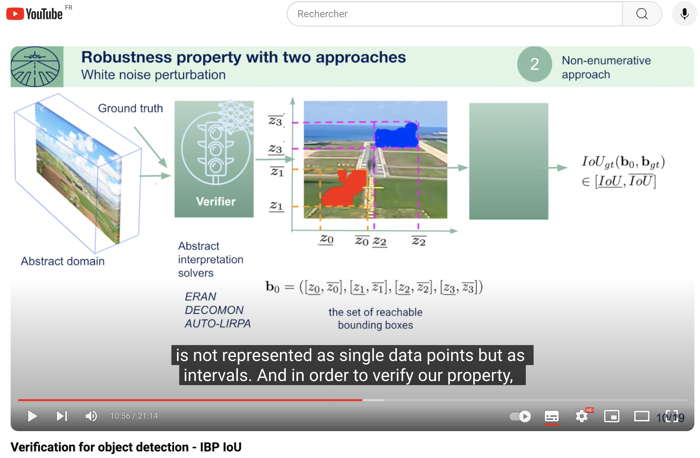
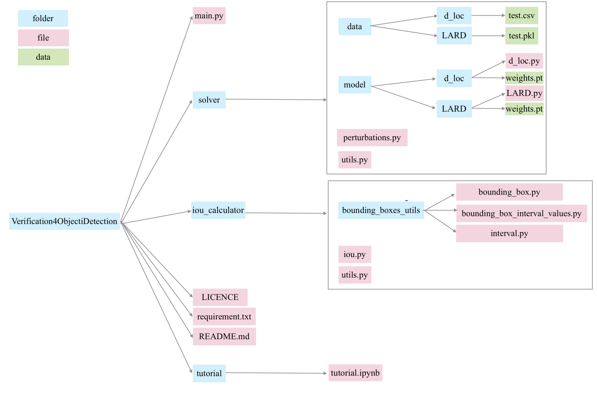

# Verification for Object Detection – IBP IoU


## IBP IoU an approach for the formal verificaion of object detection models.


To verify stability, we need to rely on the
*Intersection over Union* [(IoU)](https://en.wikipedia.org/wiki/Jaccard_index), a common metric for evaluating the performance of object detection. 


<br />

<table>
<tr>
    <td width="50%">
        <div align="center" style="border: 2px solid red; padding: 10px;">
            <a href="https://www.youtube.com/watch?v=6g7_ShGuxVI">
                
            </a>
            <p><strong>Understand the context and the contribution in 20 min, or in X min if you're watching at 1.5x speed!</strong></p>
        </div>
    </td>
    <td width="50%">
        <div align="center">
            
        </div>
    </td>
</tr>
</table>

<br />

## Abstract

We introduce a novel Interval Bound Propagation (IBP) approach for the formal verification of object detection models, specifically targeting the Intersection over Union (IoU) metric.
The approach is compatible with popular abstract interpretation based verification tools.
The resulting verifier is evaluated on:
* [LARD 🐷](https://github.com/deel-ai/LARD) landing approach runway detection 
* [DIGIT LOC](https://github.com/hukkelas/MNIST-ObjectDetection) handwritten digit recognition case studies

Comparisons against a baseline (Vanilla IBP IoU) highlight the superior performance of Optimal IBP IoU in ensuring robustness, contributing to more secure machine learning applications. 


<div align="center">
    
</div>

 <br />

 <br />

 ## 🧑‍🔬 Tutorial 

For a hands-on learning experience, a tutorial is available as Jupyter notebooks in `tutorial`!


## Software implementation


1. `main.py`: Main script to compute IBP IoU.
3. `solver/`: Contains trained networks, datasets, and algorithms for perturbation **(brightness, contrast, white-noise)** on the input with [Auto-LIRPA](https://github.com/Verified-Intelligence/auto_LiRPA) (step 1).
3. `iou_calculator/`: Contains propagation effect on the IoU (step 2: **IBP IoU**).

<div align="center">
    
</div>

## Requirements


- **`pip`** install: You can use the `requirements.txt` to install packages through:
```
pip install -r requirements.txt
```


## Verification

IBP IoU can be computed via the following command: 

```
python main.py -d <dataset> -m <methods list> -nb  <nb images> -w <list whitenoise> -b <list brightness> -c <list contrast>
```

- `dataset`: Either 'MNIST' or 'LARD'.
- `methods`: Defines the methods used to compute bounds. It can includes 'IBP', 'IBP+backward (CROWN-IBP)', and 'backward (CROWN)'. By default, these 3 methods are included.
- `nb images`: Determines the number of images to be processed. The default value is set to 40.
- `list whitenoise`: Sets the range of variation for whitenoise perturbation. The default range is from 0 to 0.002, divided into 10 intervals.
- `list brightness`: Similar to whitenoise, this argument sets the range for brightness perturbation, also defaulting to a range from 0 to 0.002 over 10 intervals.
- `list contrast`: Specifies the range for contrast perturbation, with a default range from 0 to 0.01 over 10 intervals.

For more configuration seetings, see [main.py](https://github.com/NoCohen66/Verification4ObjectDetection/blob/main/main.py).


## Licence

This project is licensed under the GNU Lesser General Public License v3.0 - see the [LICENSE.md](LICENSE.md) file for details.
 

For more information on the GNU LGPL v3, please visit [LGPL-3.0.html](https://www.gnu.org/licenses/lgpl-3.0.html).

## Authors

This project is a joint research work from ONERA and AIRBUS. 
